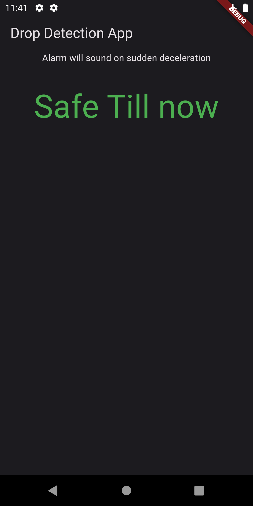
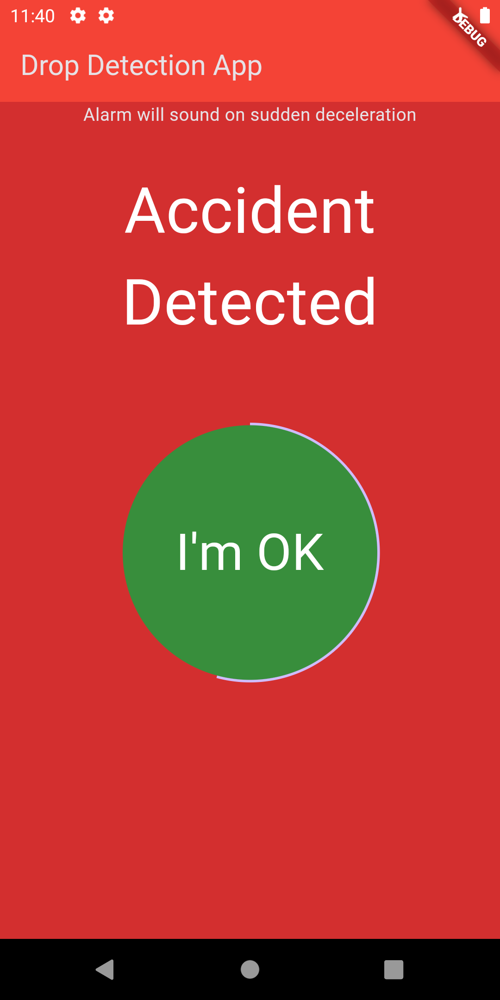
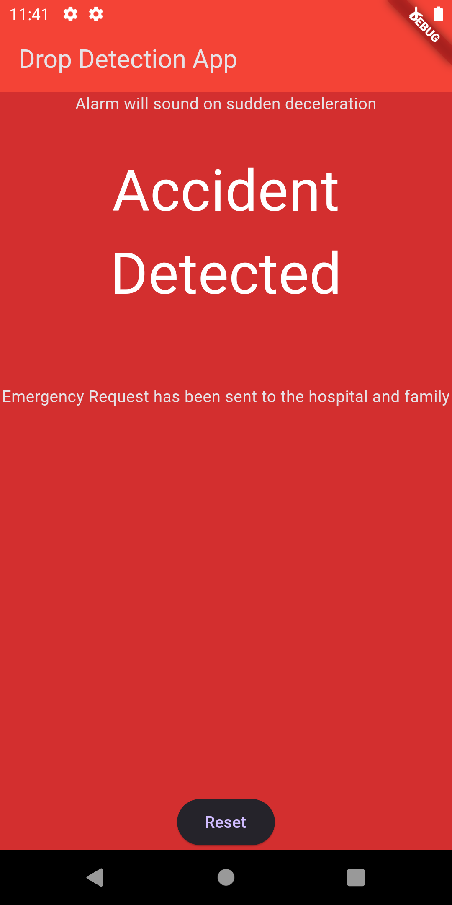

# Accident Alert Pro

An emergency accident alert system that detects accidents by reading sudden changes in acceleration of the phone from the accelerometer sensor.

### Screenshots

In normal / safe mode

When accident detected

Ambulance called and emergency signal sent to friends or family

## Running the app

Follow the steps to run the app in your device

- Download the zip or clone the project in local system
- Go to the project folder and run `flutter pub get`
- Build the app by running `flutter build apk --split-per-abi`
- select apk with the supported abi from the directory `build/app/outputs/flutter-apk/` and install

### Config

All the recommended config is already done. But you can optionally set the acceleration threshold at which accident should be detected. To do so, follow the given steps:

- In the file `lib/drop_detection.dart`, search for the line that has a comment 'Optional Config'.
- Under the comment, `Acceleration().isSuddenDeceleration()` method is called, you can pass a `threshold` property.

## Contribution

This is a beginner level project, so there is no contribution guildline included. Feel free to raise issues, propose changes or contact me for any investigation, I'll be more than happy to help out in any way possible.

### Thank You